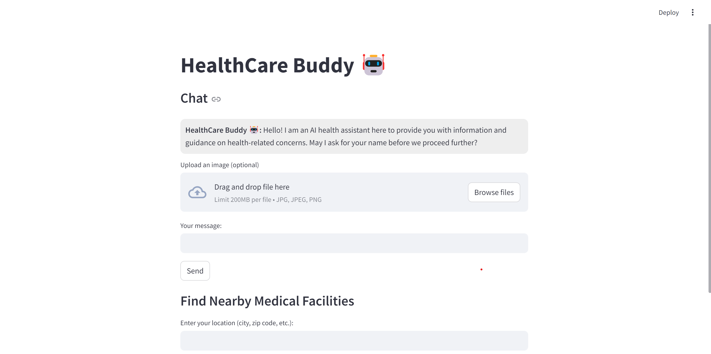
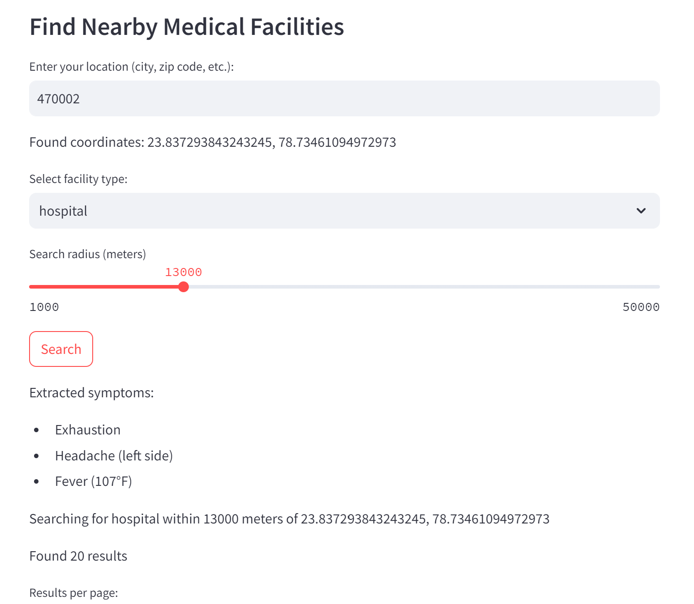

# HealthCare Buddy

**Description:**
HealthCare Buddy is an advanced conversational agent engineered to facilitate comprehensive healthcare consultations through intelligent natural language processing. It offers a plethora of health-related insights, including precautionary advice for symptoms, pharmacological recommendations, and in-depth analyses of health reports like ct-scans, blood test reports, x-rays. Moreover, the chatbot is augmented with geospatial capabilities, enabling it to provide precise localization of proximate healthcare institutions, including hospitals, physicians, and pharmacies, based on the user's real-time geographic coordinates.

## Features:
- **Symptomatology Evaluation:** Utilizes advanced algorithms to extrapolate tailored preventive measures corresponding to user-reported symptoms.
- **Pharmacological Guidance:** Delivers precise medication suggestions, drawing upon symptom-specific pharmaceutical knowledge.
- **Clinical Report Interpretation:** Analyzes and deciphers user-submitted health data, offering clinically relevant insights and diagnostic perspectives.
- **Geospatial Healthcare Facility Discovery:** Employs the Google Place API to execute precise geolocation-based searches, identifying nearby medical establishments, practitioners, and pharmacies 
  in accordance with the user's positional data.
- **Interactive Conversational Interface:** Built using Streamlit to ensure seamless bidirectional communication, fostering an intuitive user experience while engaging with the chatbot.

## Tools and Technologies:
- **Python**: Backend logic and chatbot integration.
- **Streamlit**: For building an interactive user interface.
- **OpenAI LLM Model**: For generating natural language responses and analyzing user health-related queries.
- **Google Place API**: For providing location-based suggestions for hospitals, doctors, and pharmacies.

## Installation:

1. Clone the repository:
   ```bash
   git clone https://github.com/your-username/healthcare-buddy.git
   cd healthcare-buddy
   ```

2. Install the required dependencies:
   ```bash
   pip install -r requirements.txt
   ```

3. Set up API keys:
   - Get your OpenAI API key and Google Place API key.
   - Create a `.env` file in the root directory and add the following:
     ```bash
     OPENAI_API_KEY=<your-openai-api-key>
     GOOGLE_API_KEY=<your-google-api-key>
     ```

4. Run the application:
   ```bash
   streamlit run app.py
   ```

## Usage:
1. Open the chatbot interface.
2. Interact with the bot by typing in health-related queries.
3. The bot will provide suggestions based on the user's symptoms, health data, and location.
4. Users can ask for nearby hospitals, doctors, or pharmacies, and the bot will return relevant locations.

## Future Improvements:
- Enhance symptom analysis using more advanced machine learning models.
- Integrate real-time data for health statistics and trends.
- Expand to include more health-related services such as insurance suggestions.

---

© 2024 HealthCare Buddy. All rights reserved.

Unauthorized duplication, distribution, or modification of this software is strictly prohibited. This software and its documentation are the intellectual property of Elma Anwar. Any use of code, algorithms, or content from this project must be explicitly authorized. Violators may be subject to legal action.

For permissions or inquiries, please contact: Elma Anwar




